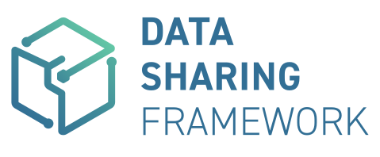
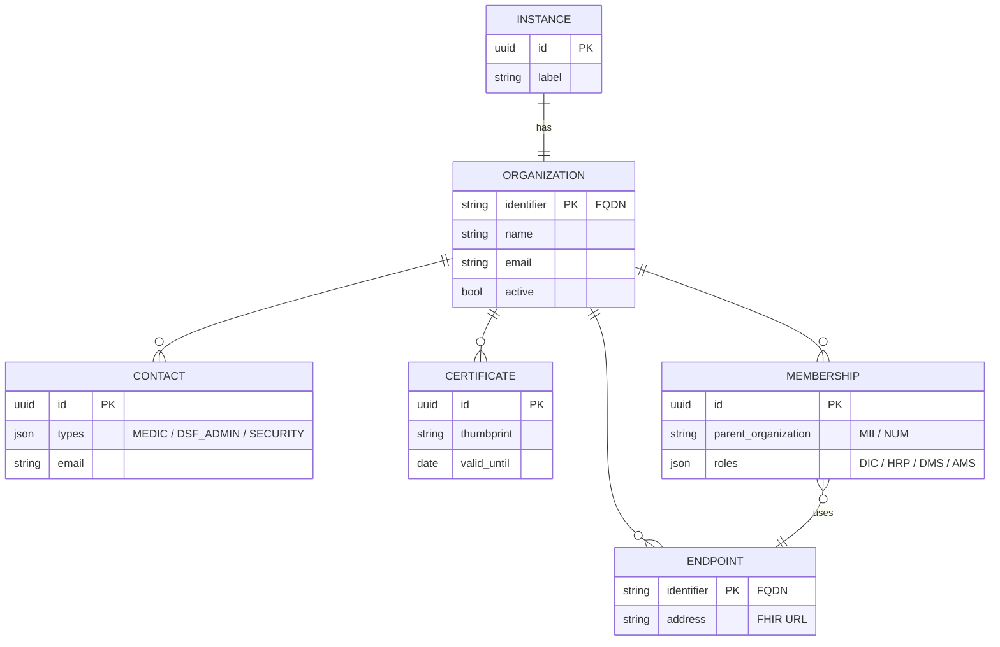
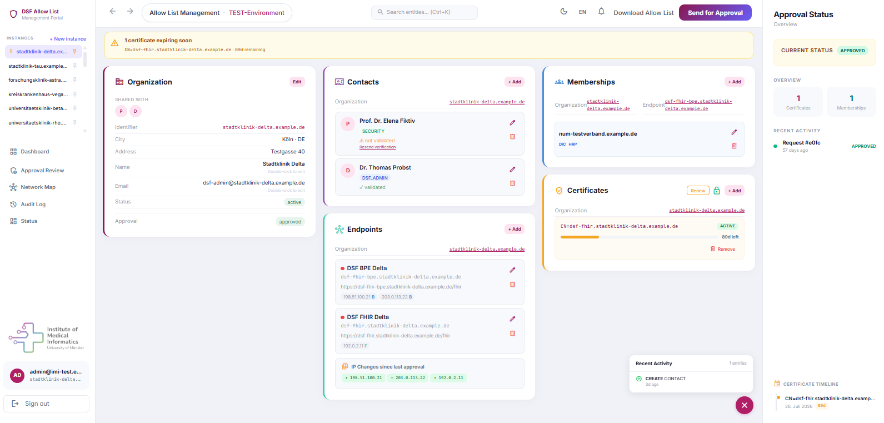
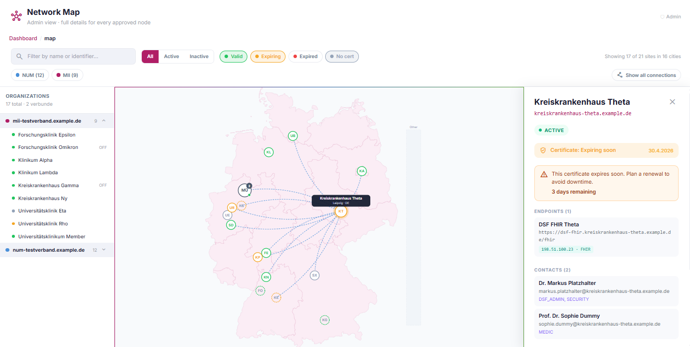
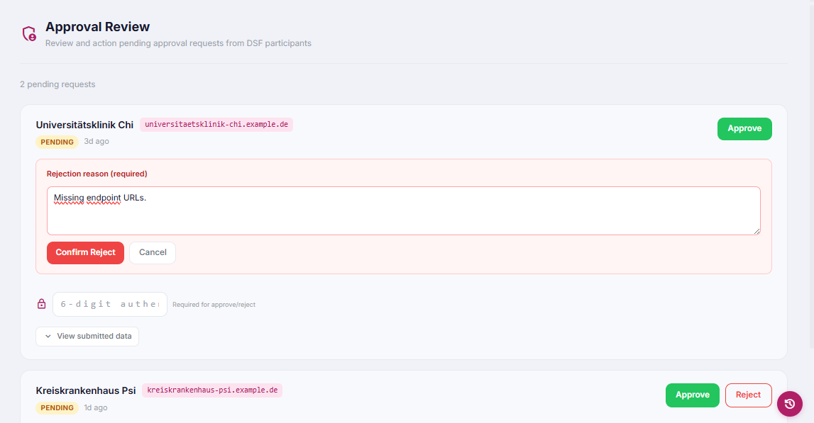
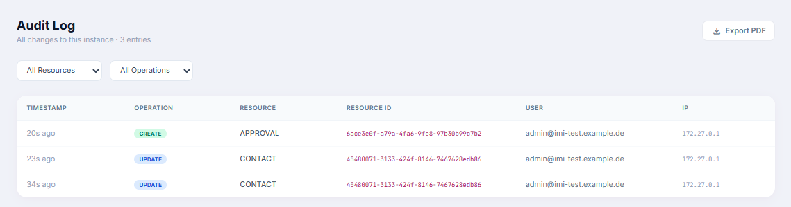
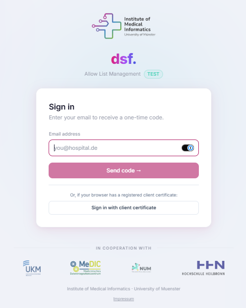
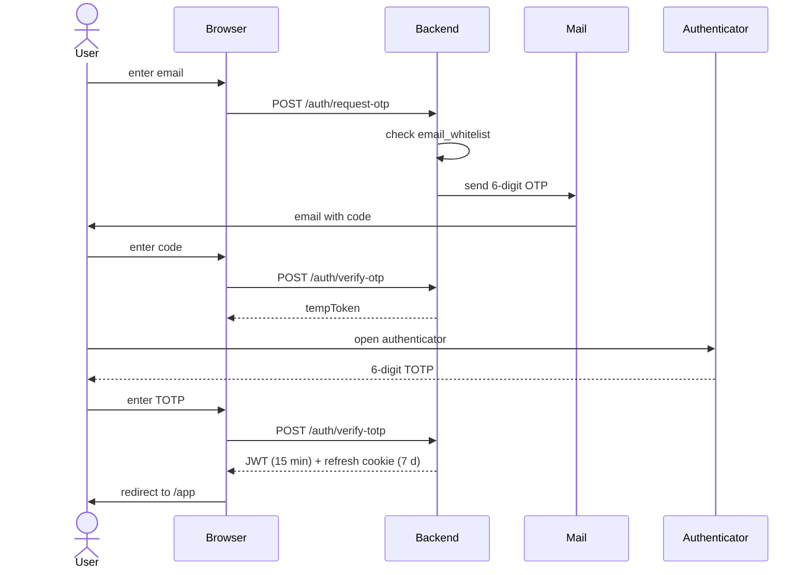

<div align="center">
  <picture>
    <source media="(prefers-color-scheme: dark)" srcset="docs/logo-dsf-dark.svg">
    
  </picture>

  <h1>DSF Management Portal</h1>
  <p>A web application for managing participants in the <strong>Data Sharing Framework (DSF)</strong> of the German Medical Informatics Initiative (MII / NUM).</p>
  <p>Operated by the <a href="https://www.medizin.uni-muenster.de/imi/das-institut.html">Institute of Medical Informatics Muenster (IMI)</a> at the University of Muenster.</p>

  <p>
    <a href="https://github.com/Mukeyii/num-dsf-allowlist/actions/workflows/ci.yml"></a>
    <a href="LICENSE"></a>
    <a href="https://www.medizin.uni-muenster.de/imi/das-institut.html"></a>
    
  </p>

  <br />

  <a href="https://www.medizin.uni-muenster.de/imi/das-institut.html"></a>
  &nbsp;&nbsp;
  <a href="https://medic.uni-muenster.de/"></a>
  &nbsp;&nbsp;
  
  &nbsp;&nbsp;
  
</div>

---

> **Single-page entity directory + workflow tooling for the German federated healthcare research network.** One canvas, five entities, full audit trail, FHIR-bundle export. Operated by IMI Münster for MII / NUM partner sites.

---

## Highlights

- 🧩 **Entity-graph canvas** — five entities for one DSF instance edited on a single page with live SVG relations
- 🗺 **Network map** — cross-instance allow-list as a Germany silhouette, peer edges by verbund (MII / NUM)
- ✅ **Approval workflow** — 4-eyes IMI review with full snapshot, 7-day silent consent, append-only audit trail
- 🔐 **Passwordless auth** — email allow-list + OTP + TOTP, optional mTLS client-cert sign-in
- 📦 **FHIR allow-list bundle** — RS256-signed downloads consumed by DSF BPE processes over mTLS
- 🧪 **CI / test pipeline** — 55 unit · 12 contract · 7 Playwright E2E · 3 visual baselines, all green on every PR

---

## Entity model



Each Instance owns exactly one Organization. The Organization has many Contacts, Endpoints, Certificates, and Memberships. Memberships reference an Endpoint to indicate which technical endpoint participates in a given verbund role.

---

## Screenshots



**Entity-graph canvas** — every entity for one DSF instance edited on a single canvas, with live SVG relations between organization, contacts, endpoints, certificates, and memberships.

| | |
|---|---|
| <br>**Network map** — cross-instance allow-list across all participating organizations, with city clusters and verbund peer edges. | <br>**Approval review** — IMI admins review and action pending submissions with the full snapshot in context. |
| <br>**Audit log** — append-only operations history, scoped per instance, filterable by resource and operation. | <br>**Sign in** — passwordless email + OTP + TOTP, plus optional client-certificate sign-in. |

---

## Quick start

```bash
git clone https://github.com/Mukeyii/num-dsf-allowlist.git
cd num-dsf-allowlist
cp .env.example .env
bash scripts/generate-keys.sh

docker compose up -d
docker compose exec backend npx ts-node src/db/seed-whitelist.ts admin@example.com
docker compose exec backend npx ts-node src/db/seed-testdata.ts   # optional
```

| Service | URL |
|---|---|
| Frontend | <http://localhost> |
| Backend API | <http://localhost/api/v1> |
| Mail UI (Mailhog) | <http://localhost:8025> |

**Prerequisites:** Docker Desktop 24+, Node.js 20 LTS (for local dev outside Docker), Git.

---

## Authentication



Passwordless: email allow-list, 6-digit OTP via email, TOTP from an authenticator app (Aegis, 1Password, Google Authenticator). Ten backup codes per user, bcrypt-hashed and single-use. Optional mTLS sign-in via the `/auth/client-cert-login` route when the browser presents a registered client certificate.

---

## Stack

<p>
  
  
  
  
  
  
  
  
  
  
  
  
</p>

State + forms: TanStack Query 5, Zustand, React Hook Form, Zod. Auth: JWT RS256 via `jsonwebtoken`, TOTP via `speakeasy`, OTP and refresh tokens cached in Redis.

---

## Documentation

| Topic | Where |
|---|---|
| API reference | [`docs/wiki/API-Reference.md`](docs/wiki/API-Reference.md) |
| Deployment guide | [`docs/DEPLOYMENT.md`](docs/DEPLOYMENT.md) |
| Security policy & threat model | [`SECURITY.md`](SECURITY.md) |
| License | [`LICENSE`](LICENSE) |

---

## API at a glance

```
POST   /auth/request-otp
POST   /auth/verify-otp
POST   /auth/verify-totp

GET    /api/v1/instances
GET    /api/v1/instances/:id/{organization,contacts,endpoints,certificates,memberships}
POST   /api/v1/instances/:id/approval/submit
GET    /api/v1/instances/:id/download/bundle
GET    /api/v1/instances/:id/audit
GET    /api/v1/network/map

GET    /fhir/Bundle/:endpointId    (mTLS — DSF BPE process)
GET    /fhir/Bundle                (mTLS — search by identifier)
```

Full reference in [`docs/wiki/API-Reference.md`](docs/wiki/API-Reference.md).

---

## Security

- Helmet-managed security headers, CSP, HSTS, X-Frame-Options
- Redis-backed rate limiting (5 r / 15 min on `/auth/`, 100 r / min on `/api/`)
- JWT RS256 only (HS256 forbidden), httpOnly + secure + sameSite=strict cookies
- Knex prepared statements only — no string concatenation
- PEM upload rejects `PRIVATE KEY` blocks at the route layer; PEM contents never logged
- Append-only `audit_logs` table, no UPDATE / DELETE permitted at the DB role
- DSGVO/GDPR: contact data is never published in the allow-list bundle

Reporting a vulnerability — see [`SECURITY.md`](SECURITY.md). Please use a private GitHub Security Advisory.

---

<details>
<summary><b>Domain & workflow details</b></summary>

### Admin console

IMI administrators access three admin pages:

- **`/app/admin`** — pending approval-request review (4-eyes, silent-consent after 7 days).
- **`/app/admin/users`** — whitelist + admin role management (lock / unlock / promote / demote / remove). All writes require TOTP re-confirmation.
- **`/app/admin/promotions`** — pending admin-promotion requests; second admin from a different site approves or rejects (NO silent consent).

Admin-role assignments are stored in `admin_grants`, each row signed RS256 over a canonical message. A DB-only attacker cannot grant themselves admin without the signing key.

The bootstrap admin set is populated on first backend start from `IMI_ADMIN_EMAILS`. After that the env var is ignored at runtime — the database is authoritative. Operators are encouraged to remove the env var from production after first boot.

### Bundle security

- Every FHIR Bundle download is **RS256-signed** (`X-Bundle-Signature` header)
- **SHA-256 content hash** logged in the audit trail (`X-Content-Hash` header)
- DSF processes authenticate via **mTLS client certificates** at `/fhir/Bundle/:endpointId`
- Client-certificate thumbprints are stored per organization

### Network map

`/app/map` renders the network-wide allow-list as a schematic Germany silhouette. Pins per organization (clustered by city), peer edges per `parent_organization` verbund (MII / NUM), filters for verbund / cert-status / city / activity. Theme-aware: dark mode inverts the silhouette palette.

### Federation safety

The Portal coexists with other Allow-List tools (e.g., a NUM-operated tool, future regional operators). Bundles emit `DELETE` only on `OrganizationAffiliation`; `Organization` and `Endpoint` records are never deleted from a participant's local FHIR server through our bundle (they may be referenced by another tool's allow-list).

Memberships removed via the UI are soft-deleted; the next bundle emission carries the corresponding `DELETE-Affiliation` entry; a daily cron at 09:00 UTC hard-deletes soft-rows older than 90 days (`MEMBERSHIP_SOFT_DELETE_RETENTION_DAYS` configurable).

</details>

<details>
<summary><b>Local development</b></summary>

### Project structure

```
num-dsf-allowlist/
├── frontend/          React SPA (Vite)
├── backend/           Express API (TypeScript)
├── db/migrations/     MySQL schema
├── nginx/             Reverse proxy configuration
├── mail/              Mailhog (dev email)
├── scripts/           Utility scripts
├── docs/              Documentation, screenshots, logos
└── docker-compose.yml Development environment
```

### Dev commands

```bash
docker compose up -d                                # full stack with hot reload
cd frontend && npm install && npm run dev           # frontend dev (standalone)
cd backend  && npm install && npm run dev           # backend dev (standalone)
cd frontend && npx tsc --noEmit                     # type-check frontend
cd backend  && npx tsc --noEmit                     # type-check backend
```

### Testing

```bash
docker compose exec backend npm test     # backend integration tests
cd frontend && npm test                  # frontend unit tests (vitest)
cd frontend && npm run test:e2e          # Playwright E2E (needs the docker stack)
cd frontend && npm run test:contract     # contract suite vs the real backend
```

### Pre-commit hooks

The repo ships gitleaks-based pre-commit hooks to block accidental commit of JWT private keys, SendGrid API keys, or TOTP encryption keys. After cloning, enable them with:

```bash
git config core.hooksPath .githooks
```

Install gitleaks (`brew install gitleaks` on macOS, `choco install gitleaks` on Windows) so the hook can run. Bypass with `git commit --no-verify` only if you understand the risk.

</details>

<details>
<summary><b>Deployment & operations</b></summary>

### Production deployment

See [`docs/DEPLOYMENT.md`](docs/DEPLOYMENT.md) for the full guide.

```bash
docker compose -f docker-compose.prod.yml up -d --build
```

### Production env additions

| Variable | Default | Notes |
|---|---|---|
| `APPROVAL_SILENT_CONSENT_DAYS` | `7` | Auto-approve approval requests after N days. |
| `MEMBERSHIP_SOFT_DELETE_RETENTION_DAYS` | `90` | Hard-delete soft-deleted memberships after N days. |
| `ADMIN_GRANT_PRIVATE_KEY_BASE64` | falls back to JWT keys | Optional separate signing key for `admin_grants`. |
| `ADMIN_GRANT_PUBLIC_KEY_BASE64` | falls back to JWT keys | Pair of the above. |
| `IMI_ADMIN_EMAILS` | (none) | Comma-separated bootstrap admins. Consumed once on first backend start, then ignored. Remove from prod after first boot. |

### Database migrations

Migration files live in `db/migrations/*.sql`. They are applied automatically by MySQL's docker entrypoint on FIRST init only. To apply a new migration to an existing dev DB:

```bash
DB_PASSWORD=$(grep ^DB_PASSWORD .env | cut -d= -f2)
docker compose exec -T db mysql -udsf -p${DB_PASSWORD} dsf_allowlist < db/migrations/008_*.sql
```

Each migration is idempotent (uses `information_schema` checks via `PREPARE` / `EXECUTE`), so re-running them is safe. CI loops `for f in db/migrations/*.sql` to apply all of them on every test DB.

</details>

---

## License

Proprietary — Institute of Medical Informatics Muenster (IMI), University of Muenster. See [`LICENSE`](LICENSE).
