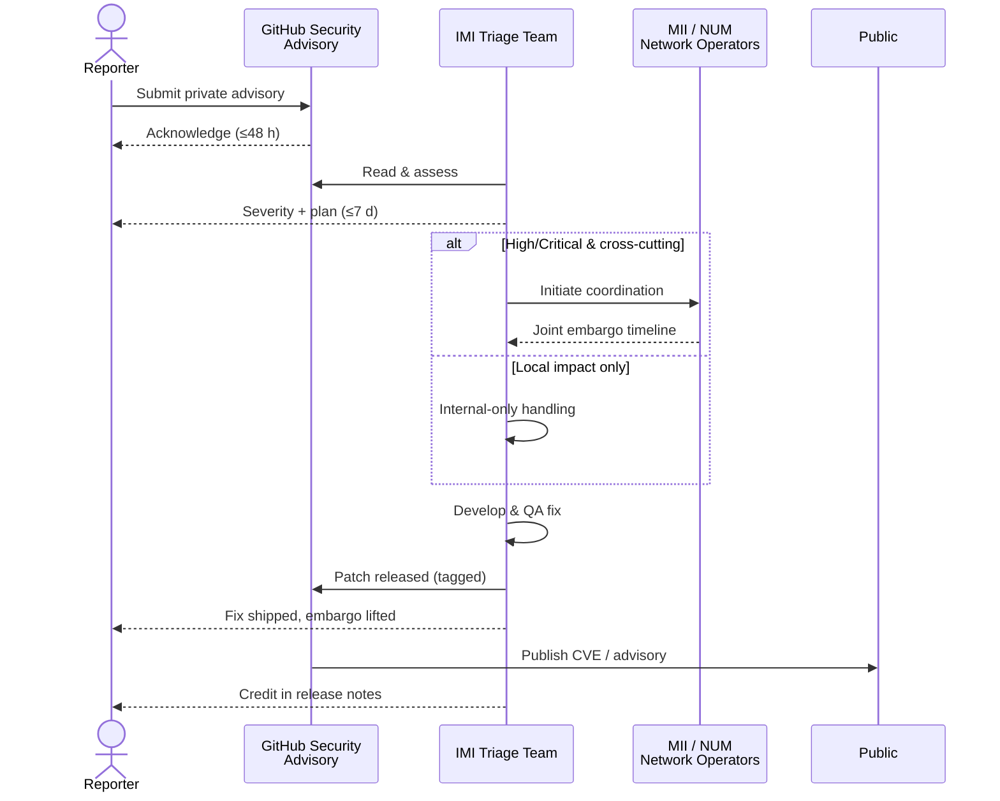
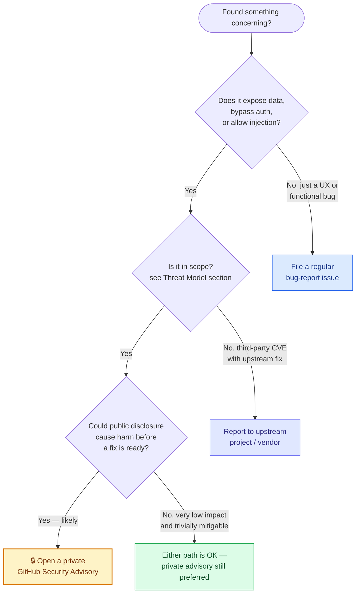
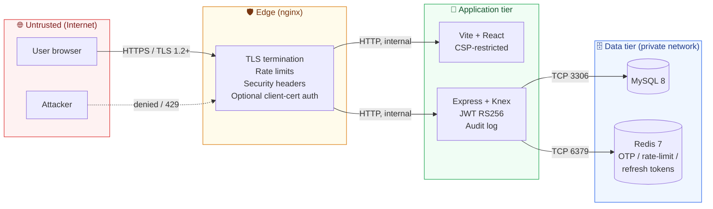

# Security Policy

The **DSF Management Portal** is operated by the Institute of Medical Informatics (IMI), University of Münster, for the German Medical Informatics Initiative (MII) and the Network University Medicine (NUM). It manages organizational, technical, and contact metadata for healthcare research nodes — data that is partially public (network membership) and partially regulated (contact details, X.509 certificates, FHIR endpoints).

This document describes how to report a security issue, how reports are handled, what is in scope, and the safe-harbor policy for good-faith research.

---

## Table of contents

- [Why this matters](#why-this-matters)
- [Reporting a vulnerability](#reporting-a-vulnerability)
- [Decision tree: should I report this?](#decision-tree-should-i-report-this)
- [What to include in a report](#what-to-include-in-a-report)
- [Threat model & scope](#threat-model--scope)
- [Severity classification](#severity-classification)
- [Response timeline](#response-timeline)
- [Coordinated disclosure (MII / NUM-wide)](#coordinated-disclosure-mii--num-wide)
- [Safe harbor](#safe-harbor)
- [Recognition (Hall of Fame)](#recognition-hall-of-fame)
- [What NOT to do](#what-not-to-do)
- [Out of scope](#out-of-scope)

---

## Why this matters

The Portal sits in the operational path of the German federated FHIR network. A compromise can:

- **Leak personally identifiable contact data** of medical staff — DSGVO/GDPR Art. 33 reportable within 72 hours.
- **Inject malicious endpoints or certificates** into the central allow-list, which downstream DSF nodes accept as authoritative.
- **Disrupt the approval workflow** for site onboarding, blocking research partners from joining the network.
- **Affect MII/NUM-wide infrastructure** if the issue is in shared cryptographic material, the FHIR bundle format, or the PKI chain.

Treat reports accordingly — even apparently low-impact issues can escalate when chained.

---

## Reporting a vulnerability

> ⚠️ **Do NOT open a public GitHub issue for security problems.** Public issues are visible the moment they are created, before any patch is available, and harm both this deployment and the wider MII/NUM network.

### Channels (in order of preference)

1. **🔒 Private GitHub Security Advisory** *(strongly preferred)*  
   Open a private advisory at  
   <https://github.com/Mukeyii/num-dsf-allowlist/security/advisories/new>  
   The report stays embargoed until a fix is ready. GitHub provides a private collaboration surface (comments, CVE tagging, CWE classification) and a one-click "Publish advisory" once the fix lands.

2. **📧 IMI institute contact** *(use if you cannot use GitHub Advisories)*  
   Operator contact via the institute's official channels:  
   <https://www.medizin.uni-muenster.de/imi/das-institut.html>  
   Mention "DSF Allow List Portal — security report" in the subject so it routes correctly.

3. **🚨 Out-of-band, urgent (active exploit)**  
   For an in-progress exploit, contact the Impressum at  
   <https://medic.uni-muenster.de/impressum/>  
   **and** also open a private GitHub Advisory so the technical team has a direct channel.

### What to expect

---

## Decision tree: should I report this?

If you are unsure whether something counts as a security issue, use the chart below. **When in doubt, report it via the private advisory** — false positives cost much less than missed vulnerabilities.

---

## What to include in a report

The more of these you can provide, the faster we can confirm and fix:

- **Title & summary** — a one-sentence description of impact.
- **Affected component** — `frontend/`, `backend/`, `nginx/`, `db/migrations/`, the Docker config, or a CI workflow path.
- **Affected version / commit** — output of `git rev-parse HEAD` or the release tag (e.g. `v0.1.0`).
- **Reproduction steps** — minimal, deterministic. A `curl` or HTTPie one-liner is great.
- **Proof-of-concept** — payload, screenshot, or video. **Redact any real production data** before attaching.
- **Impact analysis** — what an attacker could do (read data, write data, RCE, lateral movement, persistence).
- **Suggested mitigation** *(optional)* — if you already have a fix in mind.
- **Your name & affiliation** *(optional)* — for credit in the release notes. Pseudonyms accepted.

---

## Threat model & scope

The diagram below shows the trust zones the Portal runs in. Anything inside the four boxes is **in scope** for security reports; the relationships between them are also in scope when they cross a trust boundary.

### In scope

- **Frontend** application (`frontend/`) — XSS, CSRF, broken auth-state handling, leaked secrets in bundles.
- **Backend** API (`backend/`) — auth bypass, IDOR, SQL injection (we use Knex prepared statements, but please test), SSRF, command injection, deserialization.
- **nginx** edge configuration (`nginx/`) — header bypass, rate-limit evasion, TLS downgrade, request smuggling.
- **Authentication flow** — OTP entropy/replay, TOTP step window, backup-code reuse, session fixation, refresh-token replay.
- **Audit log integrity** — anything that lets a privileged user erase or rewrite audit entries.
- **Approval workflow** — bypassing the IMI-admin gate, snapshot tampering, status-machine confusion.
- **Database migrations** (`db/migrations/`) — destructive or privilege-escalating SQL.
- **CI/CD pipeline** (`.github/workflows/`) — secret leakage, artifact poisoning, runner code execution paths *triggered by untrusted PR input*.
- **FHIR allow-list bundle** generation — content forgery, signature mismatch, contact-data leakage.

### Out of scope

- **Already-disclosed third-party CVEs** with an upstream fix — please report those upstream and let us bump the dependency.
- **Issues requiring physical access** to a deployment server.
- **Social engineering** against IMI staff or institute account holders.
- **Self-XSS** (issues that require the victim to paste arbitrary code into their own browser console).
- **CSV injection** in exported XLSX files (Excel does not auto-execute formulas in our flow).
- **Denial-of-service** via expensive requests, resource exhaustion, or amplification — operationally interesting but already mitigated by nginx rate limits and not how this Portal can be meaningfully abused.
- **Missing best-practice headers** that have no concrete attack path (e.g. missing `Permissions-Policy` for an unused feature).
- **Vulnerabilities in non-default browser configurations** (disabled CSP, custom proxies, malicious extensions).
- **Issues in `docs/`, `README.md`, or comments** unless they reveal credentials or secrets.

---

## Severity classification

We use a four-tier scale aligned with CVSS guidance, plus committed SLAs for each tier.

| Severity | Examples | Acknowledge | Triage | Patch ETA |
|---|---|---|---|---|
| 🔴 **Critical** | Auth bypass on admin routes, RCE on the backend, SQL injection that exposes the full users / contacts tables, signing-key disclosure | ≤24 h | ≤72 h | ≤7 d |
| 🟠 **High** | Privileged-route bypass with limited blast radius, mass-enumeration of contacts, CSRF on state-changing endpoints, JWT signature flaws | ≤48 h | ≤7 d | ≤14 d |
| 🟡 **Medium** | Stored XSS in admin-only views, IDOR on a small subset of records, SSRF restricted to internal-only hosts, audit-log integrity issues with reduced impact | ≤48 h | ≤7 d | ≤30 d |
| 🟢 **Low** | Information disclosure of non-sensitive metadata, missing defense-in-depth headers with no concrete attack path, log spoofing | ≤7 d | ≤30 d | next minor release |

**ETAs are commitments, not maxima** — most critical issues land in main within 24 hours of confirmed reproduction.

---

## Response timeline

This is what an end-to-end report looks like for a high-severity issue.

```mermaid
gantt
    title Coordinated disclosure (illustrative, days from report)
    dateFormat X
    axisFormat Day %d
    section Reporter
    Submit advisory       :milestone, m1, 0, 0d
    section IMI triage
    Acknowledge           :a1, 0, 2d
    Severity & scoping    :a2, after a1, 5d
    Fix development       :a3, after a2, 10d
    Internal QA           :a4, after a3, 4d
    section Cross-cutting
    MII / NUM coord       :crit, b1, after a2, 21d
    section Release
    Patch tagged          :milestone, m2, after a4, 0d
    Public advisory       :milestone, m3, after m2, 0d
    Embargo lifted        :a5, after m1, 30d
```

We keep the reporter looped in at every transition: triage outcome, fix branch link, planned release tag, and the date the public advisory will be published.

---

## Coordinated disclosure (MII / NUM-wide)

If a vulnerability has potential to affect MII/NUM-wide infrastructure beyond this single deployment — for example, in a shared cryptographic library, the FHIR bundle format, or a PKI chain — IMI will coordinate disclosure with the network operators **before** any public release. Embargo windows in this case typically extend to **60–90 days** to give every node operator time to update.

The reporter is informed and consulted on the extended embargo. We do not publish coordinated-disclosure embargoes without notifying the original reporter at least 14 days in advance.

---

## Safe harbor

We support good-faith security research. **If you act in line with this policy, IMI will not pursue or support legal action against you** for activity strictly limited to the vulnerability research described in your report.

To stay within safe harbor:

- Test only against the **public test deployment** or **your own local docker-compose stack** — never the production allow-list.
- Do **not** access, modify, exfiltrate, or destroy data that does not belong to you.
- Do **not** degrade service for other users (no DoS, no resource exhaustion).
- Do **not** social-engineer IMI staff, partner organizations, or downstream MII/NUM nodes.
- Stop testing as soon as you have a working PoC and report immediately.
- Keep the report confidential until the embargo is lifted, as agreed during triage.

---

## Recognition (Hall of Fame)

We do not currently run a paid bug-bounty program. We do, however, credit reporters in:

- The **release notes** of the version that contains the fix
- A **dedicated SECURITY-ACK section** in the README (added with the next reported vulnerability)
- The **GitHub Security Advisory** for the issue, where you appear as the credited reporter

If you would prefer to remain anonymous, say so in your report and we will respect that.

---

## What NOT to do

- ❌ Open a public GitHub issue with a vulnerability description.
- ❌ Post the PoC on a blog, social media, or conference talk before the embargo lifts.
- ❌ Run automated scanners against a production deployment without prior coordination.
- ❌ Test on real participant data — use your own seeded local stack.
- ❌ Send unsolicited "we found N issues, pay us $X" messages — that is not a vulnerability report; we will not engage.

---

## Out of scope

See the [Threat model & scope](#threat-model--scope) section above for the full out-of-scope list.

---

## Questions

For non-vulnerability questions about this policy, feel free to open a regular GitHub Discussion or contact IMI through the institute's official channels.

— *Institute of Medical Informatics (IMI), University of Münster*
