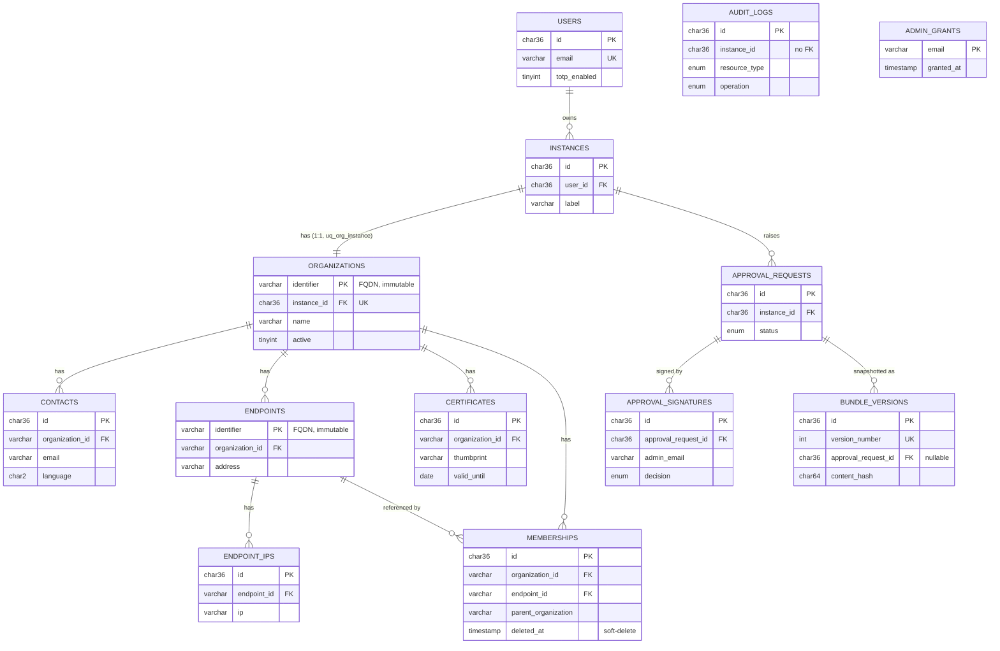

# Entity-Relationship Diagram

Core entities and their relationships. FKs use `ON DELETE CASCADE` unless noted.
`bundle_versions.approval_request_id` is `ON DELETE SET NULL`.

Notes:
- `audit_logs.instance_id` and `audit_logs.user_email` are indexed but not declared foreign keys, so they appear unconnected in the diagram.
- `admin_grants` has no foreign-key relationship to `users`; it is keyed by email.
