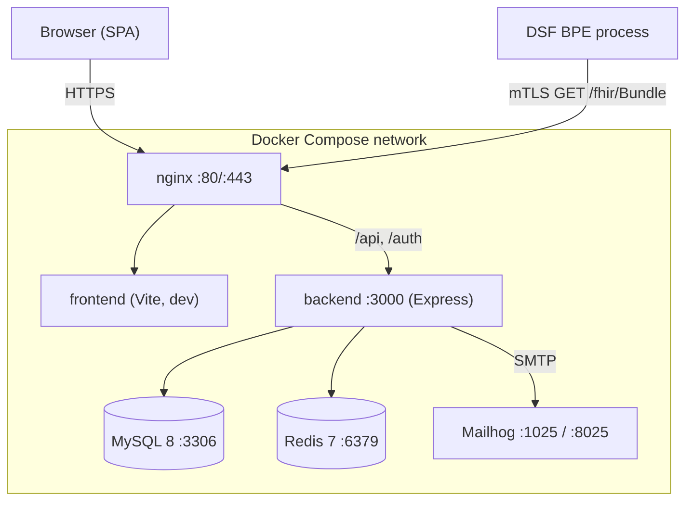
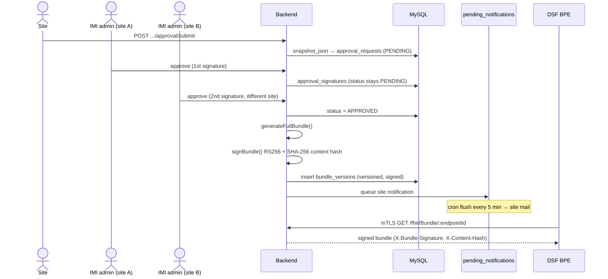

# Architecture

Technical reference for the DSF Management Portal. Covers the runtime
topology, request handling, authentication, the approval-to-bundle lifecycle,
scheduled work, and the Redis keyspace. The entity data model is documented in
[`README.md`](../../README.md#entity-model); it is not duplicated here.

## Tech stack

| Layer | Technology |
|-------|------------|
| Frontend | React 18 + TypeScript + Vite |
| State | TanStack Query v5 + Zustand |
| Forms | React Hook Form + Zod |
| Backend | Node.js 20 + Express + TypeScript |
| Database | MySQL 8 (Knex query builder) |
| Cache / sessions | Redis 7 |
| Auth | JWT (RS256) + OTP + TOTP, optional mTLS client cert |
| Email | Nodemailer (Mailhog in dev) |
| Proxy | nginx (TLS termination, rate limiting) |
| Containers | Docker + Docker Compose |

## 1. System overview

Six Docker Compose services. `nginx` is the only ingress; it terminates TLS and
proxies the SPA and the API to the backend. The backend reaches MySQL, Redis,
and Mailhog over the internal compose network. MySQL and Redis are gated by
healthchecks before the backend starts. A separate machine-to-machine path lets
a DSF Business Process Engine (BPE) pull a signed FHIR bundle over mTLS.



Health endpoints: `/health/live` (always 200) drives the compose healthcheck;
`/health/ready` probes MySQL (`SELECT 1`) and Redis (`PING`) and returns 503 if
either is down.

## 2. Request lifecycle

A normal authenticated API call traverses a fixed middleware chain in
[`backend/src/app.ts`](../../backend/src/app.ts):

1. **nginx** terminates TLS, applies its own rate limits and security headers,
   forwards to the backend with `X-Request-Id` and the real client IP
   (`trust proxy = 1`).
2. **helmet** sets CSP, HSTS (2 y, preload), `frameguard: deny`, `noSniff`,
   referrer policy, and COOP.
3. **cors** allows only `FRONTEND_URL` with credentials; methods limited to
   GET/POST/PUT/DELETE.
4. **body parsers** (`express.json` / `urlencoded`, 100 kb cap) and
   **cookie-parser**.
5. **request id** middleware assigns `req.id` (from header or a fresh UUID) for
   structured logging.
6. **rate limit** — `apiRateLimit` on `/api` (skipped under `NODE_ENV=test`).
7. **auth middleware** (`requireAuth`) verifies the RS256 Bearer JWT, sets
   `req.user`, and refreshes the `activity:{userId}` idle heartbeat in Redis
   (fire-and-forget).
8. **route → service → DB** — routers are thin; all DB access goes through the
   service layer via Knex prepared statements.
9. **error handler** maps `ZodError → 400 VALIDATION`,
   `PRIVATE_KEY_REJECTED → 400 SECURITY`, a whitelist of `*_NOT_FOUND` codes →
   404, everything else → 500 (message hidden in production).

The `/fhir` router is mounted before the API auth path: it is
machine-to-machine and authenticates by mTLS client-certificate thumbprint, not
JWT.

## 3. Authentication flow

Passwordless. Email allow-list → 6-digit OTP (email) → TOTP (authenticator app
or single-use backup code) → JWT access token (15 min) plus an httpOnly refresh
cookie (7 d). On first login the OTP step yields a `totp_setup` temp token and
the client runs `/auth/setup-totp` + `/auth/confirm-totp` instead of
`/auth/verify-totp`. Source:
[`auth.service.ts`](../../backend/src/services/auth.service.ts),
[`auth.routes.ts`](../../backend/src/routes/auth.routes.ts).

```mermaid
sequenceDiagram
    actor User
    participant FE as Browser
    participant BE as Backend
    participant R as Redis
    participant Mail
    participant App as Authenticator

    User->>FE: enter email
    FE->>BE: POST /auth/request-otp
    BE->>BE: check email_whitelist (generic error on miss)
    BE->>R: store SHA-256(otp), TTL 10 min
    BE->>Mail: send 6-digit OTP
    Mail-->>User: code
    User->>FE: enter code
    FE->>BE: POST /auth/verify-otp
    BE->>R: verify + delete OTP
    BE-->>FE: tempToken (10 min; purpose totp_required|totp_setup)
    App-->>User: 6-digit TOTP
    User->>FE: enter TOTP
    FE->>BE: POST /auth/verify-totp
    BE->>BE: verify TOTP or backup code
    BE->>R: store refresh:{sha256(token)} → userId, TTL 7 d
    BE-->>FE: JWT (15 min) + httpOnly refresh cookie (7 d)
```

Notes:

- The refresh cookie is `httpOnly`, `secure` (prod), `sameSite=strict`, scoped
  to `/auth`. Redis stores only the SHA-256 hash of the token; the plaintext
  lives solely in the cookie.
- `/auth/refresh` rotates the token (old hash deleted, new issued) and rejects
  if the `activity:{userId}` idle heartbeat has expired (`SESSION_EXPIRED`).
- `revokeAllSessions` SCANs `refresh:*` to invalidate every session for a user
  when an admin locks / demotes / removes them.
- Two alternate entry points: `/auth/client-cert-login` (registered client-cert
  thumbprint) and `/auth/dev-login` (only mounted when
  `NODE_ENV!=production && DEV_AUTO_LOGIN=true`).

## 4. Approval & bundle lifecycle

A site submits its instance for review; two IMI admins from different sites must
sign (4-eyes), or silent consent auto-approves after 7 days. The
`PENDING → APPROVED` transition triggers a post-commit snapshot of the
federation-wide bundle into `bundle_versions`, RS256-signed and content-hashed.
Site notification mails are queued in `pending_notifications` and flushed by
cron. The signed bundle is then served to DSF BPE processes over mTLS. Source:
[`approval.service.ts`](../../backend/src/services/approval.service.ts),
[`bundle-versions.service.ts`](../../backend/src/services/bundle-versions.service.ts),
[`bundle-signing.service.ts`](../../backend/src/services/bundle-signing.service.ts),
[`fhir.service.ts`](../../backend/src/services/fhir.service.ts).



Notes:

- `buildSnapshot` strips the organization `email` and includes no contact PII in
  what is later published; `generateFullBundle` emits only APPROVED + active
  organizations and never publishes contact data (GDPR).
- Each `bundle_versions` row stores the full bundle JSON (~50 KB), an RS256 JWT
  signature with a `kid` derived from the public-key fingerprint, and a SHA-256
  `content_hash`. `diffVersions` produces added/removed/changed entry buckets.
- Bundles emit `DELETE` only on `OrganizationAffiliation` (federation safety);
  `Organization` / `Endpoint` are never deleted from a peer's local FHIR server.
- `rejectRequest` records a REJECT signature, sets `REJECTED`, and queues a
  rejection mail; no snapshot is taken.

## 5. Scheduled jobs

Six cron jobs registered in
[`scheduler.service.ts`](../../backend/src/services/scheduler.service.ts), all in
UTC. Each is wrapped in try/catch so a failure is logged and does not abort the
scheduler.

| Cron | Job | Action |
|------|-----|--------|
| `*/5 * * * *` | `flushPendingNotifications` | Deliver due `pending_notifications` rows (site emails after approve/reject). |
| `0 6 * * *` | `runApprovalReminders` | Email reminders for still-pending approval requests. |
| `0 7 * * *` | `runSilentConsentSweep` | Auto-approve requests pending past the silent-consent window (default 7 d). |
| `0 8 * * *` | `runCertExpiryCheck` | Detect certificates nearing expiry and notify. |
| `0 9 * * *` | `runMembershipCleanup` | Hard-delete soft-deleted memberships older than the retention window (default 90 d). |
| `0 10 * * *` | `syncMarketplaceAll` | Sync marketplace GitHub repository metadata. |

## 6. Redis key registry

Prefixes documented in
[`redis.service.ts`](../../backend/src/services/redis.service.ts).

| Key prefix | Purpose | TTL |
|------------|---------|-----|
| `otp:{email}` | Pending SHA-256-hashed OTP code | 10 min |
| `refresh:{tokenHash}` | Active refresh token (value = userId) | 7 d |
| `ratelimit:{ip\|key}` | express-rate-limit Redis store buckets | per limiter window |
| `totp_used:{sha256}` | Anti-replay marker for a consumed TOTP code | 120 s |
| `activity:{userId}` | Last-activity heartbeat for idle-timeout | idle window (`IDLE_TIMEOUT_MS`, default 30 min) |

## 7. Security posture

Threat model and reporting process: [`SECURITY.md`](../../SECURITY.md). Key
controls visible in the codebase:

- Helmet-managed CSP, HSTS (preload), `X-Frame-Options: DENY`, `noSniff`, COOP.
- JWT RS256 only (asymmetric; HS256 not accepted on verify); refresh cookies are
  httpOnly + secure + `sameSite=strict`; Redis holds only token hashes.
- Redis-backed rate limiting on `/auth/*` and `/api/*`.
- All DB access via Knex prepared statements — no string concatenation.
- Append-only `audit_logs` (no UPDATE/DELETE at the DB role; enforced by
  triggers in migrations 013/015); audit writes are non-blocking.
- PEM upload rejects `PRIVATE KEY` material at the route layer
  (`PRIVATE_KEY_REJECTED → 400`); PEM contents are never logged.
- FHIR bundles are RS256-signed with a content hash; DSF BPE access is
  mTLS-authenticated by registered client-certificate thumbprint.
- GDPR: contact data is never published in the allow-list bundle.
